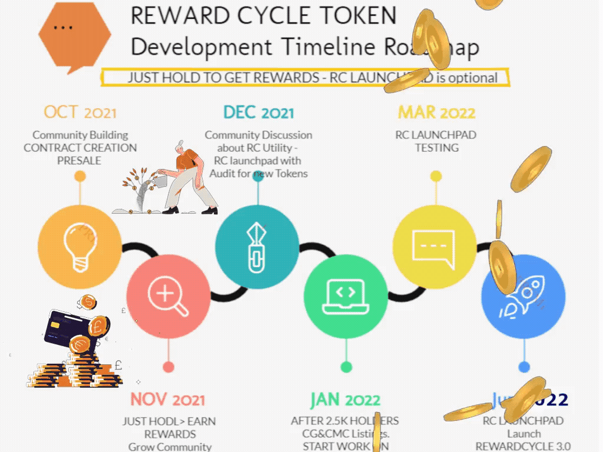

# Strategy for RC token 2021-22

**Reward Cycle** rewards you for holding and receiving one or two utility tokens such as USDT, ADA, XRP, ETH, and others.

First token of our Reward Cycle will offer USDT. The second rewards token voting soon! Hold to Earn More.


TIP: What is the difference between Roadmap and Strategy?

**Strategy** explains the approach you will take to realize that future state. And a roadmap is the more tactical plan for what you will do to get there (and when you will arrive), informed by the vision and strategy. Now, some people use the words “vision” and “strategy” interchangeably.

